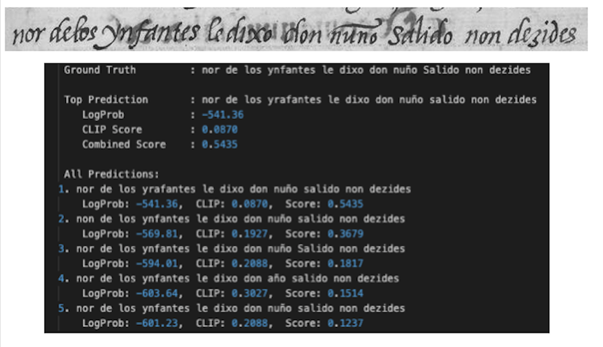
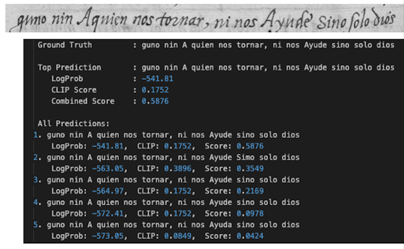
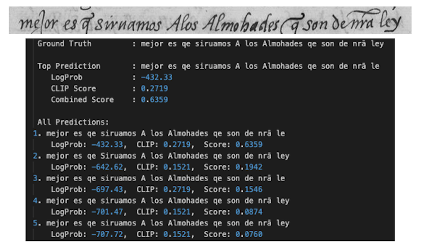
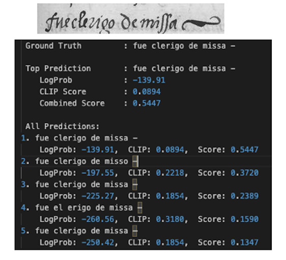
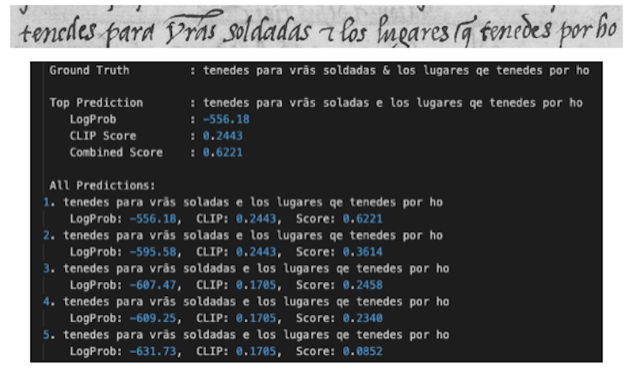
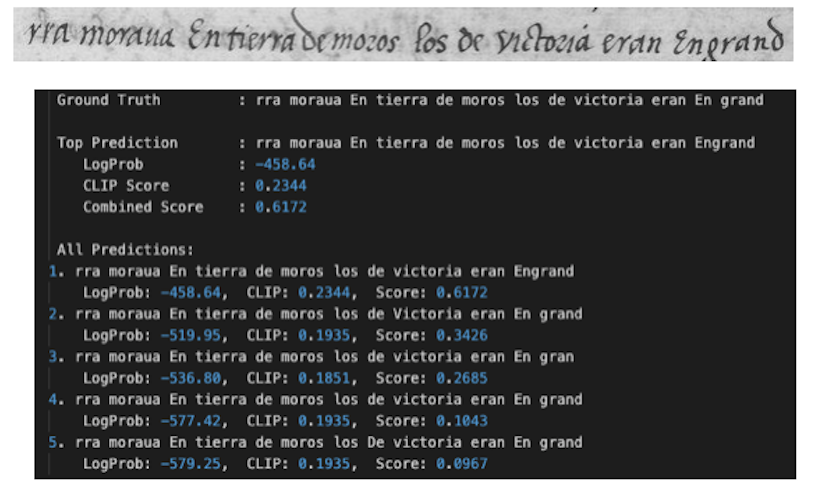

# End to end Handwritten Text Recognition

The handwritten text recognition project fine-tunes TrOCR to generate multiple handwritten text predictions, then reranks them using CLIP and score fusion. This approach combines visual and textual embeddings in a shared space to improve the accuracy of OCR on historical handwritten text.


 
---

## Stage 1: Fine-tuning TrOCR

TrOCR, a Transformer-based OCR model, is fine-tuned on a handwritten text dataset. The model is trained in a supervised manner using pairs of input images and their corresponding transcriptions. During inference, TrOCR generates multiple predictions per image using beam search. This enables the model to output a list of the top-n most probable text hypotheses based on its internal confidence.


---

## Stage 2: Beam Search Decoding

Beam search is used during inference to generate multiple plausible predictions for each image. Unlike greedy decoding, which selects only the most likely word at each step, beam search maintains several candidate sequences at once, balancing between exploration and confidence. Each candidate prediction is associated with a confidence score based on the model's softmax probabilities.


---

## Stage 3: Reranking with CLIP

CLIP (Contrastive Language-Image Pretraining) maps images and text into a shared embedding space. For each of the 5 predictions from TrOCR's beam search, we compute the similarity between the image and each predicted text using CLIP. This allows us to assess how well each text semantically aligns with the visual content of the input image.


---

## Stage 4: Score Fusion

To further improve reranking, we fuse the TrOCR model’s confidence scores with CLIP’s similarity scores. This balanced strategy considers both visual grounding and language confidence. The final score for each candidate prediction is calculated using a weighted combination:


---

## Stage 5: mBART Correction

mBART is used as a post-correction module to fix transcription-level issues like spelling errors, grammar inconsistencies, or contextual mistakes. It is fine-tuned on pairs of noisy OCR outputs and their corrected versions. By leveraging language-level patterns, mBART polishes the top prediction without relying on visual cues.

---
## Project Structure

```

.
├── data_preparation.ipynb       
├── results.ipynb        # final output after reranking
├── Dataset/            (download from the provided drive link)            
├── Working_dataset/
├── output/  # csv file output before reranking               
└── src
    ├── trocr_finetune.py
    ├── evaluate.py
    ├── reranking.py
├── model/    # finetuned trocr model (download from the provided drive link)
├── environment.yml   # to create the environment                   


````

---

##  **Results**









---

---
## Implementation Guide**

### **1. Create environment**

```bash
conda env create -f environment.yml
```

###2. Run the Main Script:
   
Execute the main script:
```bash
python trocr_finetune.py 
```

```bash
python evaluate.py 
```

```bash
python reranking.py 
```
  

---
